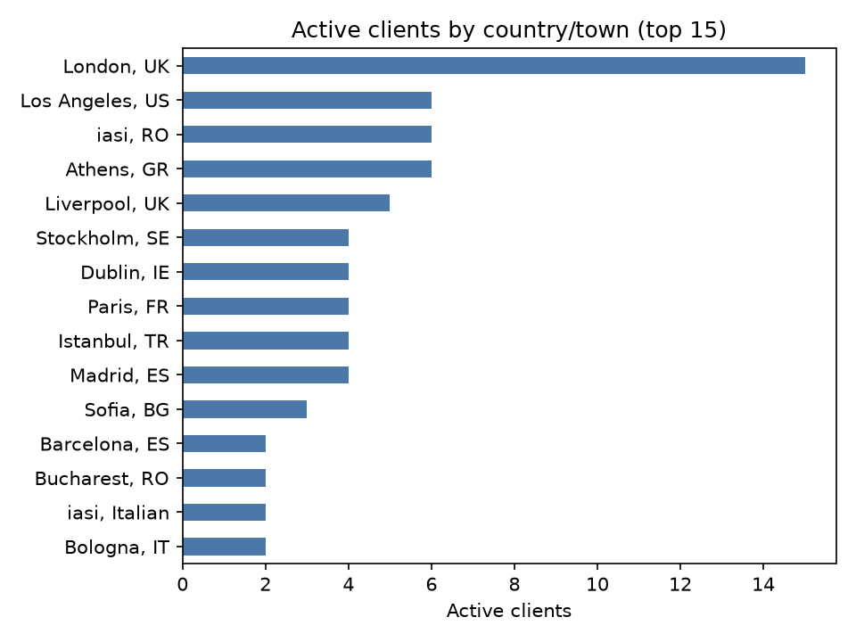
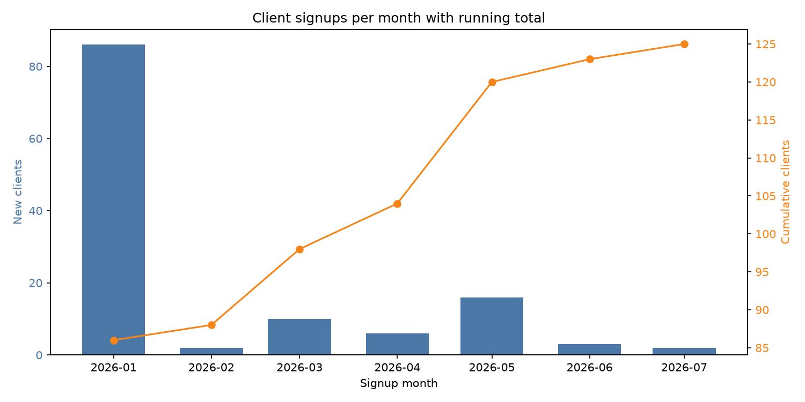
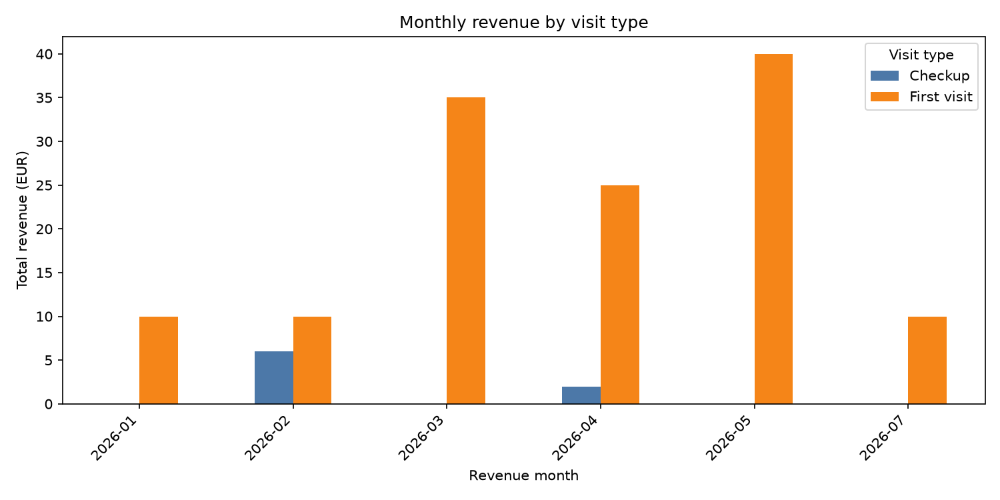
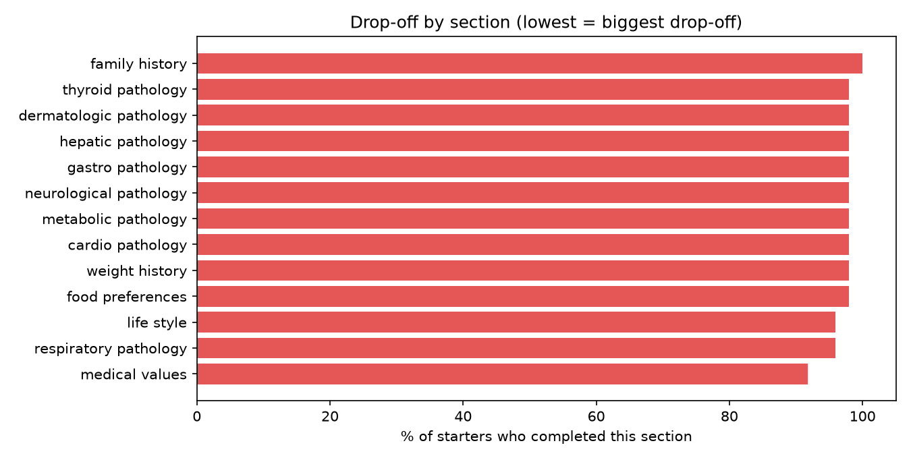

# SQL_Health

A SQL portfolio project built on an anonymized clone of a imaginary nutrition/health
app's MySQL database. It showcases CTEs, window functions, transactions, and
views through queries scoped to the app's "client" domain (profiles, payments,
first-visit intake funnel), explored via Jupyter notebooks.

Stack: Docker (MySQL) + Jupyter Lab + pandas + SQLAlchemy + matplotlib/plotly.

## Highlights

<table>
<tr>
<td></td>
<td></td>
</tr>
<tr>
<td align="center"><sub>§1.1 — active clients by location</sub></td>
<td align="center"><sub>§1.2 — signups/month, CTE + window functions</sub></td>
</tr>
<tr>
<td colspan="2" align="center"></td>
</tr>
<tr>
<td colspan="2" align="center"><sub>§2.1 — monthly revenue by visit type, CTE + <code>LAG()</code></sub></td>
</tr>
<tr>
<td colspan="2" align="center"></td>
</tr>
<tr>
<td colspan="2" align="center"><sub>§3.2 — drop-off by section, first-visit intake funnel</sub></td>
</tr>
</table>

## Repo layout

```
notebooks/            Jupyter notebooks that run the queries against the DB
sql/                  Query files organized by SQL feature showcased
  ctes/
  views/
  transactions/
data/                 Local DB dump (gitignored — never commit real data)
requirements.txt      Python dependencies
```

## Setup

```bash
python3 -m venv .venv
source .venv/bin/activate
pip install -r requirements.txt

docker compose up -d          # starts MySQL, loads data/dump.sql
cp .env.example .env           # fill in DB credentials
jupyter lab
```

## Notebooks

| Notebook | Description |
|---|---|
| `01_overview.ipynb` | Connects via the read-only analyst account and pulls the patient/cardio master view |
| `02_allUsers.ipynb` | Lists all users and charts them by sex |
| `03_allUsersWomen.ipynb` | Filters users to `sex = 2` |
| `04_activeClientsByCountryAndTown.ipynb` | Active clients grouped by country/town (query 1.1 in the reference doc) |
| `05_clientSignupsMonthlyRunningTotal.ipynb` | Monthly signups with cumulative running total and MoM growth % (query 1.2) |
| `06_blockedClientAudit.ipynb` | Blocked clients self-joined to the admin who blocked them, plus reason/admin breakdowns (query 1.3) |
| `07_clientActivityRecencyRanking.ipynb` | 50 clients most overdue for re-engagement, ranked by last visit/payment activity (query 1.4) |
| `08_monthlyRevenueByVisitType.ipynb` | Monthly paid revenue split by visit type, with month-over-month change via `LAG()` (query 2.1) |
| `09_paymentStatusFunnel.ipynb` | Payment counts/gross amount by status, with each status's share of total via `SUM() OVER()` (query 2.2) |
| `10_firstVisitYearlyEligibility.ipynb` | Days until each client is eligible for another paid first visit under the 365-day rule (query 2.3) |
| `11_checkupEligibility.ipynb` | Clients past the 30-day checkup window with no paid checkup yet (query 2.4) |
| `12_topPayingClients.ipynb` | Top 20 clients by total paid amount, ranked via `RANK()` (query 2.5) |
| `13_paymentConfirmationTransaction.ipynb` | Reference-only transaction (not executed) confirming payment + locking the visit atomically (query 2.6) |
| `14_perClientCompletionPct.ipynb` | Per-client completion % of the 23-section first-visit form via a CTE unpivoting the `*_completed` flags (query 3.1) |
| `15_dropOffBySection.ipynb` | Completion rate of every section among clients who started the form, to spot the biggest drop-off point (query 3.2) |

Notebooks with charts save a copy to `assets/img/` (via `plt.savefig(...)`) so
the images in **Highlights** above can be regenerated by re-running the
notebook against a live DB, without needing a screenshot.

## Query reference

This project implements queries grouped by domain:

1. **User / client profile** — active clients by location, signups over time
   with running totals, blocked-client audit, activity-recency ranking
2. **Payments & revenue** — monthly revenue trends, payment status funnel,
   visit-eligibility rules, top-paying clients, a payment-confirmation
   transaction
3. **First-visit** — per-client completion %,
   drop-off by section, time-to-lock, pathology prevalence, and a
   headline `v_client_visit_summary` view

Each query is written to be copy-pasted into `sql/ctes/`, `sql/views/`, or
`sql/transactions/`, or run directly in a notebook.

## Data privacy

The database is a Docker-local clone seeded from `data/dump.sql`
(gitignored). Only anonymized or fully synthetic data is used — no real
patient data is ever committed to this repo.

users created (chat gpt) with a migration generated with simple formula: actors -> doctors 10% && singers -> patients 90%
